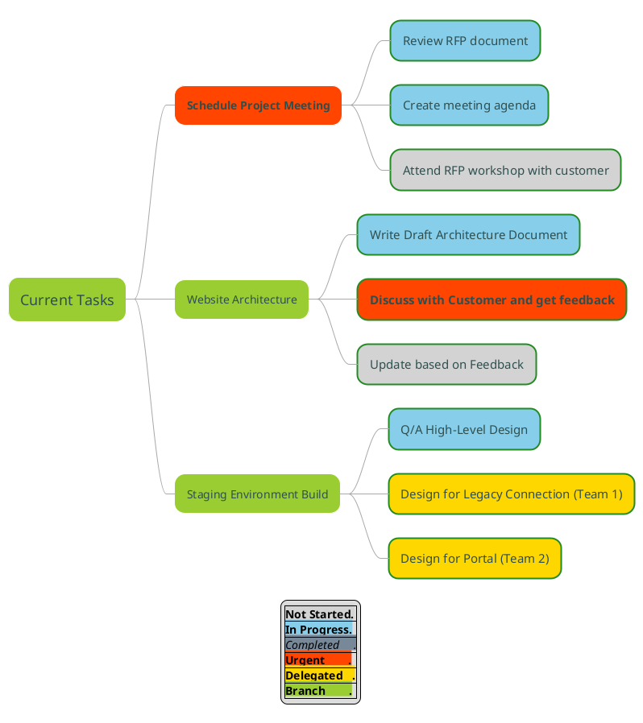

OS:  FreeBSD 13   
Shell:  csh   
Python version:  3.8.12 

---

Kroki provides an HTTP API to create diagrams from textual descriptions. 
It handles both ```GET``` and ```POST``` requests. 
When using ```GET``` requests, your diagram must be encoded in the URI (URL) 
using a deflate + base64 algorithm.  
If you don't want to use deflate and base64, you can also send your 
diagram as plain text using ```POST``` requests.  


**NOTE:**  
In the following examples, I use the [HTTPie](https://httpie.io/) command 
line HTTP client and [curl](https://curl.se/) command line tool and library 
for executing ```GET``` and ```POST``` requests.    


---

### Colours

#### Send the Data from a File in a POST Request with PNG as the Output Format
 

Print all all named colours suggested by PlantUML using a special diagram description:

```
% cat colors_plantuml.txt 
@startuml
colors
@enduml
```

```
% cat \
 colors_plantuml.txt | \
 http \
 http://localhost:8000/plantuml/png \
 Content-Type:text/plain > \
 colors_plantuml.png
```

```
% xv colors_plantuml.png
```


---


**References:**   

[Choosing colors - PlantUML](https://plantuml.com/color)   
[qywx / PlantUML-colors](https://github.com/qywx/PlantUML-colors)   
[Kroki - Diagram types and output formats](https://kroki.io/#support)  


### Gantt Chart

#### Send Data from a File in a POST Request with SVG as the Output Format

Based on [Drawing diagrams with PlantUML](https://www.linux-magazine.com/Issues/2020/235/PlantUML-Diagrams)    
(Linux Magazine article from June 2020 [Issue 235/2020](https://www.linux-magazine.com/Issues/2020/235))    
(Retrieved on Mar 2, 2022)   


```
% cat gantt_plantuml.txt
@startgantt
' Based on https://www.linux-magazine.com/Issues/2020/235/PlantUML-Diagrams
scale 1.5
Project starts 2022/03/02
[Prestudy] lasts 10 days and is colored in Lavender/Blue
[Milestone 1] happens at [Prestudy]'s end
[System simulation] lasts 9 days and is colored in Coral/Green and starts 1 day after [Prestudy]'s end
[Use cases def.] lasts 7 days and ends at [Prestudy]'s end
[Compliance\nspecs] lasts 3 days and ends at [Use cases def.]'s start
[Select testers] is colored in Coral/Green
[Select testers] lasts 5 days and starts at [Use cases def.]'s start
[Train testers] starts 1 days after [Milestone 1]'s end and lasts 7 days
@endgantt
```

```
% cat \
 gantt_plantuml.txt | \
 http \
 http://localhost:8000/plantuml/png \
 Content-Type:text/plain > \
 gantt_plantuml.png
```

```
% xv gantt_plantuml.png
```


### Mind Map


#### Output from ```GET``` - Encoded in the URI (URL) using a deflate + base64 algorithm

Based on [PlantUML-Examples repo](https://github.com/mattjhayes/PlantUML-Examples/blob/master/docs/Misc/BlogSource/Other-Uses-for-PlantUML/tasks-diagram.md)    
(Retrieved on Mar 2, 2022)   

and   

[Diagrams as Code (PlantUML)](https://mattjhayes.com/2019/08/17/diagrams-as-code-plantuml/)   
(Retrieved on Mar 2, 2022)   


```
% cat mindmap_plantuml.txt
@startuml
' Based on https://github.com/mattjhayes/PlantUML-Examples/blob/master/docs/Misc/BlogSource/Other-Uses-for-PlantUML/tasks-diagram.md
' https://mattjhayes.com/2019/08/17/diagrams-as-code-plantuml/



Send a POST request using [HTTPie](https://httpie.org/), [HTTP Clients - Kroki documentation](https://docs.kroki.io/kroki/setup/http-clients/) to generate the mind map image.  

```
% http \
 http://localhost:8000/ \
 diagram_type='plantuml' \
 output_format='png' \
 diagram_source='@mindmap_plantuml.txt' \
 > mindmap_plantuml.png
```


```
% xv mindmap_plantuml.png
```


Alternatively, you can display the image in a web browser.  

```
% command -v python
 
% command -v python3
 
% command -v python3.8
/usr/local/bin/python3.8
 
% ls -lh /usr/local/bin/python*
-r-xr-xr-x  1 root  wheel   5.1K Feb  2 17:12 /usr/local/bin/python3.8
-r-xr-xr-x  1 root  wheel   3.1K Feb  2 17:12 /usr/local/bin/python3.8-config
lrwxr-xr-x  1 root  wheel    50B Feb 12 17:41 /usr/local/bin/pythontex -> ../share/texmf-dist/scripts/pythontex/pythontex.py
```

```
% python3.8 --version
Python 3.8.12
```

Using a Python to encode your diagram using deflate + base64: 


```
% cat \
 mindmap_plantuml.txt | \
 python3.8 -c \
 "import sys; import base64; import zlib; \
 print(base64.urlsafe_b64encode(zlib.\
 compress(sys.stdin.read().encode('utf-8'), 9)).decode('ascii'))"
```


The above command returns a value:   

```
eNq9VU1v2zgQvetXzC1uAFlxFsW2gWEktpvsAk7rjRMEewsljiXWFCnwI47b5r93SEuO0ySH7mEFCJDIx_feDGfIU-uYcb6WyQGMmUUOWkHlXGNPsqwUrvJ5v9B1VjPnvlZsgzabS6bczeUs_fTA6kbSSC51Tgjr0GRcFza7FLbIxlKXC-1NgdkXV6FJbyzadKlN2jFkjtmVTblgpWF1v-ZkotN-Eoz6x0eDj9nRh2zwZ9bCbcpsWmiOaRPoKIQsubu7636S0xhZLRSvWZPYlVANo2VwZoxeT7TUBqbMrC4MbpKhdRuJo6RFT7cK8D0BUKQQPwDmjHOhShi8j7-XzJRCdX9jVhCX9opvuf9FKfWa2FHF-XOt3JPqQjKHUTrMzYTC7dxtJRzuxq4rUawUWguD_lGr-SBqX98K7ir44zgMPtJrtHaf_wejYW4hviEMPvyW8eBRIlv-V48zUVbuwrDNbzh8_4vDc23Quqc4n_s83vk8gEUoBgtOA2sauQkfsVAh7xqESst5exLR5LoxujSBpSfe0VhftDGGMMq9MBarzVh63AlRYVP_OOLsFXFh8cbCGH8b6F4SolEQjklRvJKZFrvV8qZE5aDno5B_Q-iLYarEK-S_aORa8h0VR4kli7Z5ZONvsF10qx6TYda22AHMkJxwCl7S4WBBIRFRinME3_BIWzPlmaTMn6S9REZ48mOYE_vJrhJGw3z0WTvaLOpy5P1hlo_oJczoRwdu8x2gfyuYt7v0KnQ_w0jkYjTZbU54aJF4sWiXraBws01w-7wqEvIRoNNdAt8A7vVkwI9Jp6hep6bctBlKDmHijQkmrkO5JgkcwqKokHvaQYr-KxYOLhFd6Lvh0I9GtDmHcIX3AtdwdT4HOrx9HQiGlIDt7MQgOYW6XcaCFNubP3Mu7GZYvdZmZSvdwJruDSi8dbpGE23cYm7pgKDDtwgHReG8wbj81oThqWFL92wSpi-tTOlW8dRlkX7S0gMj9RIdLKmOQk72IruJ9fTUtuctZJsZx8oQ0Sd1L4xWUWvsRazYQ_gnO4O_qCbSGd6jhClaUap9L9uBZWhO2stiAxOtFHkXpNO7Rro9Bu8Iz1_i59pQx7ag4w6UnFIau9sqfIc77CfVVW5A
```


Copy and paste the output to your web browser: 

```
http://localhost:8000/plantuml/svg/eNq9VU1v2zgQvetXzC1uAFlxFsW2gWEktpvsAk7rjRMEewsljiXWFCnwI47b5r93SEuO0ySH7mEFCJDIx_feDGfIU-uYcb6WyQGMmUUOWkHlXGNPsqwUrvJ5v9B1VjPnvlZsgzabS6bczeUs_fTA6kbSSC51Tgjr0GRcFza7FLbIxlKXC-1NgdkXV6FJbyzadKlN2jFkjtmVTblgpWF1v-ZkotN-Eoz6x0eDj9nRh2zwZ9bCbcpsWmiOaRPoKIQsubu7636S0xhZLRSvWZPYlVANo2VwZoxeT7TUBqbMrC4MbpKhdRuJo6RFT7cK8D0BUKQQPwDmjHOhShi8j7-XzJRCdX9jVhCX9opvuf9FKfWa2FHF-XOt3JPqQjKHUTrMzYTC7dxtJRzuxq4rUawUWguD_lGr-SBqX98K7ir44zgMPtJrtHaf_wejYW4hviEMPvyW8eBRIlv-V48zUVbuwrDNbzh8_4vDc23Quqc4n_s83vk8gEUoBgtOA2sauQkfsVAh7xqESst5exLR5LoxujSBpSfe0VhftDGGMMq9MBarzVh63AlRYVP_OOLsFXFh8cbCGH8b6F4SolEQjklRvJKZFrvV8qZE5aDno5B_Q-iLYarEK-S_aORa8h0VR4kli7Z5ZONvsF10qx6TYda22AHMkJxwCl7S4WBBIRFRinME3_BIWzPlmaTMn6S9REZ48mOYE_vJrhJGw3z0WTvaLOpy5P1hlo_oJczoRwdu8x2gfyuYt7v0KnQ_w0jkYjTZbU54aJF4sWiXraBws01w-7wqEvIRoNNdAt8A7vVkwI9Jp6hep6bctBlKDmHijQkmrkO5JgkcwqKokHvaQYr-KxYOLhFd6Lvh0I9GtDmHcIX3AtdwdT4HOrx9HQiGlIDt7MQgOYW6XcaCFNubP3Mu7GZYvdZmZSvdwJruDSi8dbpGE23cYm7pgKDDtwgHReG8wbj81oThqWFL92wSpi-tTOlW8dRlkX7S0gMj9RIdLKmOQk72IruJ9fTUtuctZJsZx8oQ0Sd1L4xWUWvsRazYQ_gnO4O_qCbSGd6jhClaUap9L9uBZWhO2stiAxOtFHkXpNO7Rro9Bu8Iz1_i59pQx7ag4w6UnFIau9sqfIc77CfVVW5A
```

Here's the result:  


### POST Requests

When calling Kroki with ```POST``` method, you don't need to encode your diagram.  

#### POST Requests with HTTPie and with Data from a File

```
% cat hello.txt
{ 
  "diagram_source": "digraph G { Hello -> World }",
  "diagram_type": "graphviz", 
  "output_format": "svg" 
}
```

```
% http http://localhost:8000/ < hello.txt > hello.svg
```

```
% rsvg-convert hello.svg > hello.png
```

```
% xv hello.png
```


----

#### POST Requests with curl  

```
% curl -d '{ \
 "diagram_source": "digraph G { Hello -> World }", \
 "diagram_type": "graphviz", \
 "output_format": "svg" \
 }' \
 -X POST http://localhost:8000/ \
 > hello.svg
```

```
% rsvg-convert hello.svg > hello.png
```

```
% xv hello.png
```


